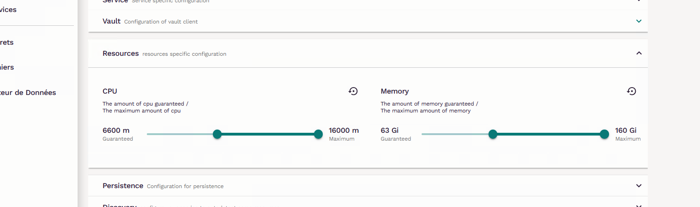

# Algorithme pour découper type de voie, nom de voie et complément d'adresse à partir d'un libellé de nom de voie brut.

## Getting started

Dans son namespace sur LS, ouvrir un service vs-python en paramétrant les ressources de cette façon : 


Lancer dans un terminal bash : 
```{bash}
git clone https://gitlab.insee.fr/geographie/gaia/gaia-decoupage-libelles-voies.git
cd gaia-decoupage-libelles-voies/
source ./setup.sh
```
Il faudra se munir de son identifiant GitLab et de son token pour pouvoir cloner le projet.


## Lancer le traitement d'un fichier

Placer le fichier dans l'espace de stockage s3, et configurer le fichier src/decoupage_libelles/scripts_parallelises/config.yml :  

- s3_bucket: Dossier où le fichier à traiter se trouve. Ex : "travail/projet-ml-moteur-identification-gaia/confidentiel/personnel_non_sensible".  
- input_path: Nom du fichier. Ex : "voies_01.csv".  
- sep: Si c'est un fichier csv, préciser le séparateur. Ex : ",". Si c'est un parquet, mettre "".  
- encodeur: Si c'est un fichier csv, préciser l'encodeur. Ex : "utf-8". Si c'est un parquet, mettre "".  
- var_name_nom_voie: Nom de la variable dans laquelle on va extraire le type de voie. Ex : "nom_voie_complet".  

Dans le terminal bash, lancer :  
```{bash}
python decoupage_libelles/scripts_parallelises/main.py
```

Le fichier traité sera enregistré dans le même dossier avec le même format et le même nom de fichier suivi de "_parse".  

Pour livrer un fichier traité en prod, le placer dans un des dossiers "Livraison" prévu à cet effet sur applishare : "\\pd_as_ge_d1_50\ge_data_pd\gaia_pd".