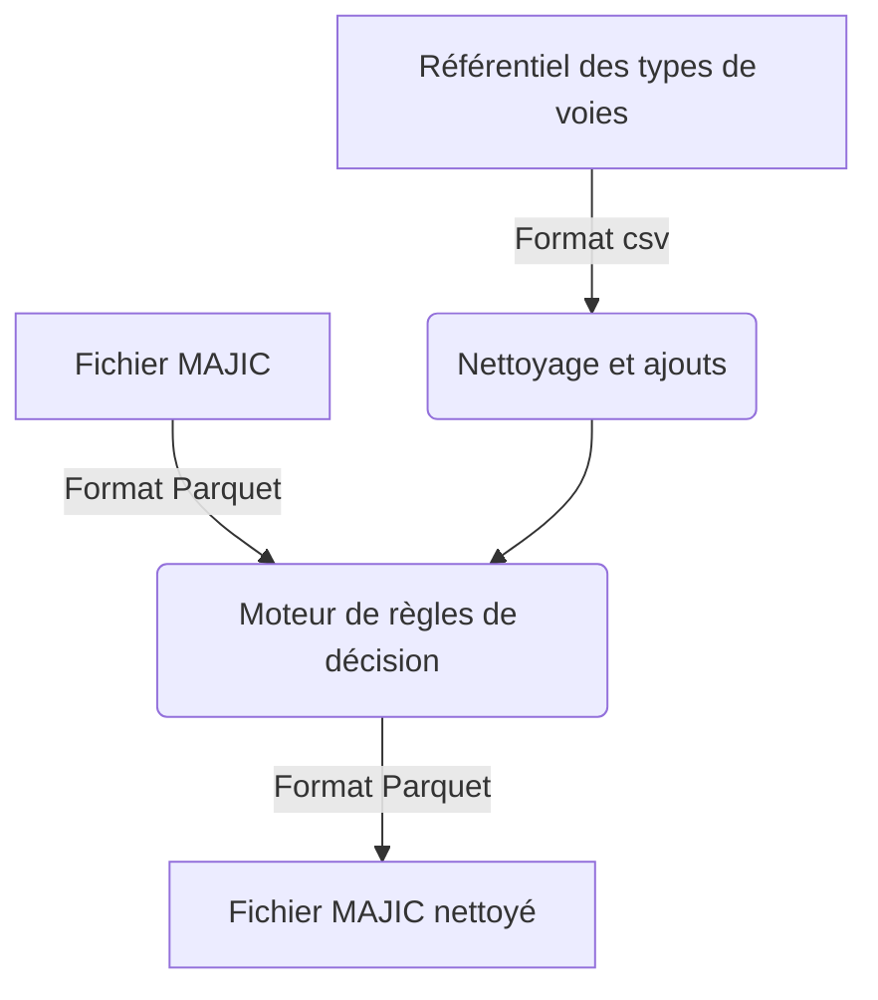

# Découpage des libellés de voies

## Objectif du programme

L'objectif du programme est d'analyser les libellés de voies issus du fichier MAJIC et de les travailler de manières à récupérer les types de voies éventuellement contenus dans les libellés.

Par exemple, pour un libellé de voie `Avenue Verdier`, le programme le transforme en un type de voie `Avenue` et un libellé de voie `Verdier`.

## Processus

