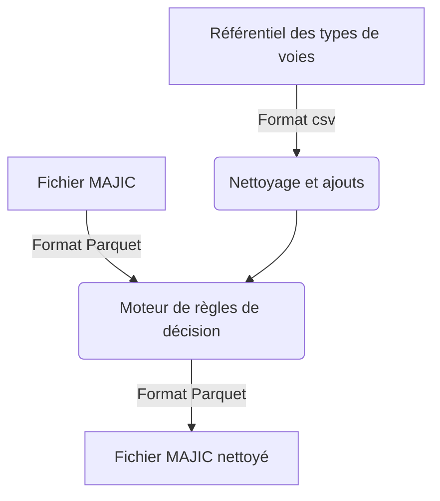

# Découpage des libellés de voies

## Processus

```mermaid
flowchart TD
    A[Fichier MAJIC] -->|Format Parquet| M(Moteur de règles de décision)
    C[Référentiel des types de voies] -->|Format csv| D(Nettoyage et ajouts)
    D --> M
    M --> |Format Parquet| R[Fichier MAJIC nettoyé]
```